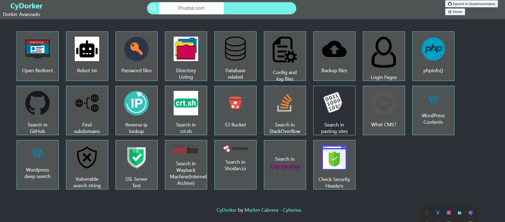

<p align="center">
  <a href="README.md">
    
    <strong>Español</strong>
  </a>
  &nbsp;|&nbsp;
  
  <strong>English</strong>
  &nbsp;|&nbsp;
  <a href="https://www.youtube.com/watch?v=xvFZjo5PgG0&list=RDxvFZjo5PgG0&start_radio=1&pp=ygUTcmljayByb2xsaW5nIG5vIGFkc6AHAQ%3D%3D">
    
    <strong>日本語</strong>
  </a>
</p>

# CyDorker

CyDorker is a passive reconnaissance tool that automates and simplifies the information gathering phase in cybersecurity audits. It is oriented towards OSINT (Open Source Intelligence) on domain names, making it easier to access public data useful for initial analysis.

- GitHub Pages: https://cyberiuscompany.github.io/CyDorker/
- DeepWiki: https://deepwiki.com/cyberiuscompany/CyDorker

---

<p align="center">
  
</p>

---

## 🔍 Available Dorkers in CyDorker (27)

1. 🌐 **Open Redirect** – Detects open redirections  
2. 🤖 **Robots.txt** – Inspects site crawling rules  
3. 🔑 **Password files** – Searches for `.env`, `.htpasswd`, `passwd`, etc.  
4. 📂 **Directory Listing** – Finds unprotected directory indexes  
5. 🗃️ **Database related** – Looks for `.sql`, `.db`, `.sqlite` files  
6. ⚙️ **Config and log files** – Searches for `.conf`, `.log`, `.ini` files  
7. 💾 **Backup files** – Detects `.zip`, `.bak`, `.tar`, `.old`, etc.  
8. 🔐 **Login Pages** – Identifies login panels  
9. 💻 **phpinfo()** – Detects exposed `phpinfo()` pages  
10. 🐱 **Search in GitHub** – Finds exposed code/data in public repos  
11. 🌍 **Find Subdomains** – Detects related subdomains  
12. 🔁 **Reverse IP Lookup** – Domains hosted on the same IP  
13. 📜 **crt.sh Lookup** – Publicly indexed SSL certificates  
14. 🪣 **S3 Bucket Discovery** – Finds public Amazon S3 buckets  
15. 💬 **StackOverflow Search** – Related questions on StackOverflow  
16. 📄 **Pasting Sites** – Leaks on Pastebin, Ghostbin, etc.  
17. 🧩 **What CMS?** – Detects Content Management System  
18. 📝 **WordPress Contents** – Looks for common WP files  
19. 🔍 **WordPress Deep Search** – Advanced WordPress inspection  
20. 🛡️ **Vulnerable Search Strings** – Searches for attack patterns  
21. ✅ **SSL Server Test** – Checks SSL certificate strength  
22. 🕰️ **Wayback Machine Search** – Archived site versions  
23. 🛰️ **Shodan Search** – Info on exposed ports/devices  
24. 🧠 **grep.app Search** – Deep public repo searching  
25. 🛑 **Check Security Headers** – Verifies HTTP security headers  
26. 🌐 **Passive Subdomain Resolution** – Passive DNS resolution  
27. 🧾 **Sensitive Strings & Exposed Configs** – Indexed sensitive keywords

---

## 🖼️ Preview

### Main Index


### Starting a sample search (Sensitive PDFs)


### Search result (Sensitive PDFs)


---

## 🧩 Project Structure

```plaintext
CYDORKER/
├── files/                 # JS, CSS, etc.
├── images/                # Graphic resources
├── icono.ico              # Browser icon
├── index.html             # Main HTML file
├── index.js               # Main search logic
├── test.svg / test.js     # Test files
├── README.md              # This file
└── *.png                  # Screenshots
```

---

## 📄 Additional Documentation

- [🔐 Security](.github/SECURITY.md)  
- [📜 License](LICENSE)  
- [🤝 Code of Conduct](.github/CODE_OF_CONDUCT.md)  
- [📬 Contributing](.github/CONTRIBUTING.md)  
- [📢 Support](.github/SUPPORT.md)  
- [⚠️ Legal Notice](DISCLAIMER.md)  

---

## ⚙️ How to use

1. Clone the repository:
   ```bash
   git clone https://github.com/cyberiuscompany/CyDorker.git
   cd CyDorker
   # Open index.html in a browser
   # OR use the live version:
   # https://cyberiuscompany.github.io/CyDorker/
   ```
